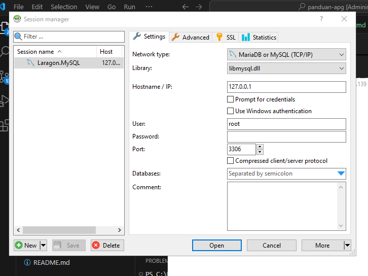

# **Instalasi**

## Instalasi Aplikasi server

Serperti yang disinggung sebelumnya, untuk mempermudah proses installasi kita akan menggunakan aplikasi server laragon, ikuti langkah langkah berikut:

1. Kunjungi halaman resmi laragon pada [link berikut](https://laragon.org/download/).
2. Pada bagian **Edition**, Klik **Download Laragon-full(173 MB)** untuk mengunduh aplikasi laragon.
3. Setelah proses download selesai, double Klik pada file **Laragon-wamp.exe** untuk melakuakn installasi.
4. Klik **Next** dan **Instal** sampai selesai, lalu klik **Finish**.
5. cukup klik tanda ++x++ untuk me-minimize  aplikasi laragon.

## Mengunduh Aplikasi

Untuk mengunduh aplikasi ini, lakukan langkah-langkah berikut:

1. kunjungi halaman release aplikasi pada [link berikut](https://github.com/masipnu/apg/releases/tag/v1.0).
2. Untuk kode sumber dalam format ZIP dengan klik `source code (zip)` pada bagian Assets.
3. Anda akan mendapatakan file `apg-1.0-zip`.
4. Ekstrak file tersebut pada direktori `c:\laragon\ww`.
5. Anda akan mendapati direktori tersebut `apg-01`, silahkan rename menjadi `apg`.

## Instalasi Database

karena Aplikasi ini bekwerja menggunakan database maka kita perlu mengatur databsenya terlebih dahulu sebelum diajalankan.

1. Buka apliaksi laragon.
   ![Laragon]/images/01.png
2. Klik `Database` untuk membuka aplikasi manajemen database Heidi SQL.
   
3. Biarkan bagian password (kosong), lalu Klik **Open**.
   ss
4. Saat jendela heidi sql terbuka, klik menu `file` > `Run SQL file`, lalu arahkan ke file `apg.sql` yang berada didirektori `C:laragon\www\apg\database` dan klik **Open**.jika ada peringatan, klik **yes**.
5. Selama tidak ada pesan `eror`, berarti database sudah tersedia.
6. tekan tombol ++f5++ pada jendela Heidi SQL untuk me-refresh database, maka anda akan menemukan database `apg` lengkap dengan struktur tabel beserta contoh datanya.
7. sekarang anda bisa menutup aplikasi Heidi SQL dan me-minimize laragon.


## Konfigurasi Aplikasi


Setelah mengatur database, kita perlu melakukan konfigurasi databse pada aplikasi APG.
Ikuti langkah-langkah berikut.

1. Buka file `config.php` pada direktori `c:\laragon\www\APG\library` dengan teks editor. bisa visual studio code atau notepad.
2. Atur konfigurasi user dan password database pada baris berikut

```php
<?php
$host = "localhost";
$user = "root";
$pass = 
$db = "apg";

$con = mysqli_connect($host, $user, $pass, $db);

if (mysqli_connect_errno()) {
    echo "Koneksi gagal! : " . mysqli_connect_error();
}
?>
```
3. karena pada user root tidak memakai password, maka saya rubah


